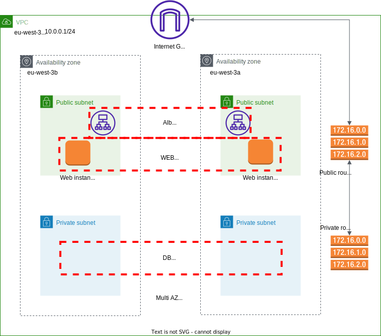

# projet_Dawan

## _Déploiement d’une infrastructure LAMP dans AWS avec Ansible et Terraform_

~~~

* prerequise

-installer terraform sous windows
-compte github 
-installer git 
-Générer une paire de clés pour une connexion sécurisée dans Windows
-ajoutez votre clé SSH publique à github
-installation de visual studio code
-installation aws cli sous windows
- créer un compe AWS
-créer un utilisateur IAM sur le service Web Amazon
-Générer une clé d'accès pour un utilisateur IAM
-Configurer la clé sous le repertoire C:\Users\utilisateur\.aws
     https://docs.aws.amazon.com/fr_fr/cli/latest/userguide/cli-configure-profiles.html

# si vous traaivillez en equipe :
Stocker l'état de terraform avec un compartiment S3
créer une table dynamoDB pour verrouiller l'état de terraform : .terraform.lock.hcl

~~~

## introduction 

Le but est d'automatiser au **maximum** notre infrastructure. Nous avons de nombreux outils sur le marché pour automatiser la gestion des infrastructures, et ils fonctionnent très bien. **Terraform** est mon outil préféré en raison de la communauté active et de la simplicité à comprendre. Ensuite, pour la partie configuration, nous utiliserons **Ansible**.

Une pile **LAMP** est un ensemble de quatre technologies logicielles différentes que les développeurs utilisent pour créer des sites web et des applications web. LAMP est un acronyme du système d'exploitation Linux, du serveur web Apache, du serveur de base de données MySQL et du langage de programmation **PHP** ou **PYTHON**.

***

***
Nous allons créer l'infrastructure étape par étape. Pour cela, nous utiliserons les ressources Terraform.
tout d'abord on va créer notre reseau et contrôler le trafic vers les ressources à l'aide de groupes de sécurité
ensiute on va deployer les instances avec la déploiements Multi-AZ qui améliorent la disponibilité, la durabilité des donnés et la tolérance aux pannes pour les instances de bases de données et les instances de webs

***

le fichier playbook ansible est sur cette addresse github : 
 - https://github.com/123sdfd/lamp-playbook01.git

