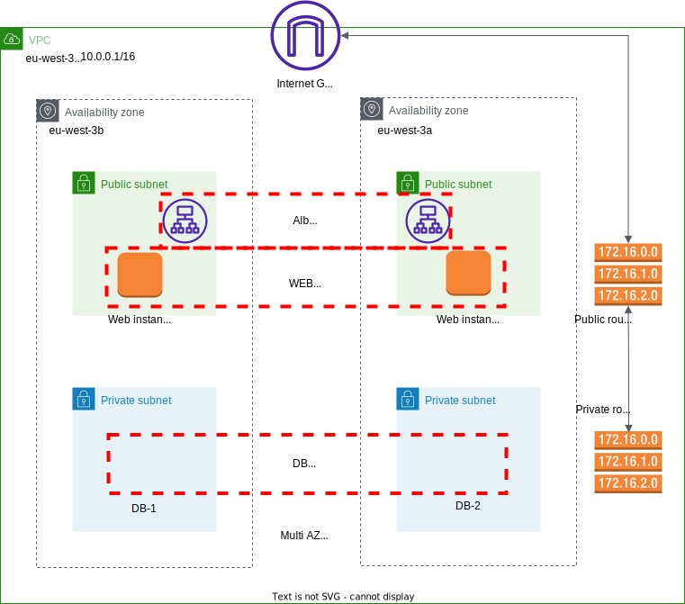

# projet_Dawan

## _Déploiement d’une infrastructure LAMP dans AWS avec Ansible et Terraform_

 # 
 Prérequis :
- Installer Terraform sous Windows
- Créer un Compte Github 
- Installer Git 
- Générer une paire de clés pour une connexion sécurisée sous Windows
- Ajouter la clé SSH publique à Github
- Installer Visual studio code
- Installer AWS CLI sous windows
- Créer un compte AWS
- Créer un utilisateur IAM sur le service Web Amazon
- Générer une clé d'accès pour l'utilisateur IAM
- Configurer la clé pour l'utilisateur sous le repertoire 'C:\Users\utilisateur\.aws'

# 
Si vous travaillez en équipe :
- Stocker l'état de terraform avec un compartiment S3
- Créer une table dynamoDB pour verrouiller l'état de Terraform : .terraform.lock.hcl

## Introduction 

Le but est d'automatiser au **maximum** notre infrastructure. Il y a de nombreux outils sur le marché pour automatiser la gestion des infrastructures, et ils fonctionnent très bien. **Terraform** est mon outil préféré en raison de la communauté active et de la simplicité à comprendre. Ensuite, pour la partie configuration, nous utiliserons **Ansible**.

Une pile **LAMP** est un ensemble de quatre technologies logicielles différentes que les développeurs utilisent pour créer des sites web et des applications web. LAMP est un acronyme du système d'exploitation Linux, du serveur web Apache, du serveur de base de données MySQL et du langage de programmation **PHP** ou **PYTHON**.

***

***
Nous allons créer l'infrastructure étape par étape. Pour cela, nous utiliserons les ressources Terraform.
Tout d'abord on va créer notre reseau et contrôler le trafic vers les ressources à l'aide de groupes de sécurité.
Ensuiteé on va déployer les instances avec le déploiement Multi-AZ qui améliore la disponibilité, la durabilité des données et la tolérance aux pannes pour les instances de bases de données et les instances de webs.
Dans un déploiement Multi-AZ Amazon RDS, il crée automatiquement une instance de base de données primaire et réplique de manière synchrone les données vers une instance dans une autre zone de disponibilité. Lorsqu'il détecte un échec, Amazon RDS bascule automatiquement vers une instance de secours sans intervention manuelle.

***

Le fichier playbook Ansible est sur cette adresse Github : 
 - https://github.com/123sdfd/lamp-playbook01.git

***
# Configuration Terraform
Nous allons exécuter les commandes Terraform : 

~~~
 - terraform init 
 - terraform plan
 - terraform apply
~~~

 # 
 Finalement nous allons detruire les machines créées, afin de ne pas avoir à payer.

 ~~~
 - terraform destroy
 ~~~

 #  
 

